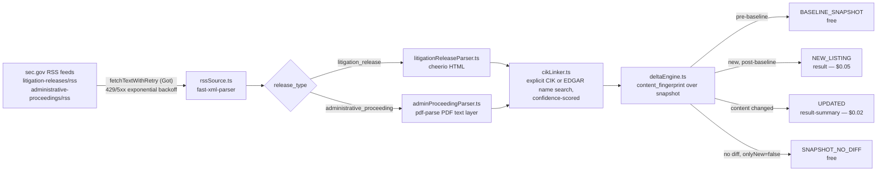

<h1 align="center">SEC Enforcement & Litigation Release Delta Feed</h1>
<p align="center"><em>A pay-per-event delta feed over SEC.gov's own litigation-release and administrative-proceeding RSS feeds for the United States (SEC) — not another 10-K/8-K filings scraper — that runs on your own configured Apify schedule.</em></p>

<p align="center">
  <a href="https://apify.com"></a>
  <a href="https://apify.com/stefano_seggio/sec-enforcement-litigation-delta-feed"></a>
  <a href="https://www.typescriptlang.org/"></a>
  <a href="LICENSE"></a>
</p>

<p align="center"><sub>The MIT license covers this wrapper repository's documentation and integration code only — the Actor's own scraping/delta-engine implementation is proprietary and runs exclusively on Apify's platform.</sub></p>

## Run it now

<p align="center">
  <a href="https://apify.com/stefano_seggio/sec-enforcement-litigation-delta-feed">
    
  </a>
  <a href="https://apify.com/stefano_seggio/sec-enforcement-litigation-delta-feed">
    
  </a>
</p>

This Actor is **live and public** on the Apify Store at [apify.com/stefano_seggio/sec-enforcement-litigation-delta-feed](https://apify.com/stefano_seggio/sec-enforcement-litigation-delta-feed) — anyone with an Apify account can run it directly, no invitation or private link needed. Owner console: [console.apify.com/actors/EDhT9Mvrdm2hzTECA](https://console.apify.com/actors/EDhT9Mvrdm2hzTECA).

## What this is

If you've gone looking for an **SEC EDGAR API alternative** that covers enforcement actions rather than routine filings, the honest answer is that EDGAR's own APIs don't structure this data at all: SEC publishes litigation releases and administrative proceedings as plain RSS feeds and free-prose HTML/PDF documents, not as a queryable enforcement dataset. This Actor walks SEC.gov's own `/enforcement-litigation/litigation-releases/` and `/enforcement-litigation/administrative-proceedings/` RSS feeds directly — the same two official feeds SEC itself publishes — and turns each release into a structured, delta-classified dataset row: parsed respondent(s), statute or rule citations, a best-effort monetary-sanction breakdown, and a linked EDGAR CIK where SEC's own data resolves one with sufficient confidence.

It exists to stop the manual loop of polling `sec.gov/enforcement-litigation` for new litigation releases and PDF administrative orders, opening each one to read who's named and what statute was cited, then separately searching EDGAR by hand to see if a respondent maps to a public company's CIK. The Apify Store is already saturated with **10-K/8-K/Form-4 EDGAR-filings scrapers** covering routine disclosure; this Actor deliberately sits outside that niche and reads SEC's enforcement actions and administrative proceedings instead — the regulatory-data surface most filings scrapers don't touch.

There is no fixed operator-side cadence: this Actor runs whenever you schedule it, on your own Apify Scheduler (cron), against a persistent delta state that survives between runs.

## Cost & BYOK Disclosure

| Event | Field | Price | Charged when |
|---|---|---|---|
| New Enforcement Release | `result` | **$0.05** | A litigation release or administrative proceeding not previously seen, once this schedule's baseline is established |
| Updated Release Content | `result-summary` | **$0.02** | Content on a previously-delivered release changed — real but rare, since SEC releases/orders are largely append-only once published |
| Actor start | — | **$0.00005/GB-memory** | Once per run, regardless of how many (if any) records are delivered |
| Baseline / no-diff snapshots | — | Free | Only delivered when `onlyNew: false`; never charged |

A record's `content_fingerprint` is recomputed over its full snapshot on every run. When that fingerprint matches the value stored from the last run, the record is classified as an unchanged repeat and is suppressed before delivery — it is **never billed**. Only a first-time listing or a genuine content change reaches your dataset as a charged event.

**No third-party API key required.** BYOK status: **none**. This Actor calls only sec.gov's own free public RSS feeds and EDGAR's own free public CIK-resolution data — there is no paid third-party API in the pipeline, and no key of any kind for you to supply. Monetization is transparent by design: there's no metered free trial of paid events, so run once with `onlyNew: false` to validate field quality against real, current SEC releases at zero cost before a single `NEW_LISTING` or `UPDATED` event is ever charged.

## Quickstart

Get an API token from the Apify Console (**Settings → Integrations**). All three examples below run the real, public Actor (`stefano_seggio/sec-enforcement-litigation-delta-feed`, Actor ID `EDhT9Mvrdm2hzTECA` — either identifier works with the API/SDKs) with its one required field, `userAgent`.

### cURL (instant, synchronous)

Runs synchronously and returns the resulting dataset items directly in the response — no polling needed.

```bash
curl -X POST "https://api.apify.com/v2/acts/EDhT9Mvrdm2hzTECA/run-sync-get-dataset-items?token=<YOUR_API_TOKEN>" \
  -H "Content-Type: application/json" \
  -d '{
  "userAgent": "YourCompany your-email@example.com",
  "maxItemsPerRun": 50,
  "onlyNew": true
}'
```

### Python (`apify_client`)

```python
# main.py - calls the SEC Enforcement & Litigation Release Delta Feed Actor
# and prints its delta dataset items. Run with: APIFY_API_TOKEN=xxx python main.py
import os
from apify_client import ApifyClient

client = ApifyClient(os.environ["APIFY_API_TOKEN"])

run_input = {
    "sources": ["litigation_releases", "administrative_proceedings"],
    "onlyNew": True,
    "enableCikLinking": True,
    "cikMatchConfidenceThreshold": 0.8,
    "userAgent": "Acme Compliance Monitoring contact@acme.com",
}

run = client.actor("stefano_seggio/sec-enforcement-litigation-delta-feed").call(run_input=run_input)

dataset_items = client.dataset(run["defaultDatasetId"]).list_items().items
for item in dataset_items:
    print(f"{item['event_type']}: {item['release_number']} - {item['primary_respondent']}")
```

### Node.js (`apify-client`)

```javascript
import { ApifyClient } from 'apify-client';

const client = new ApifyClient({ token: process.env.APIFY_TOKEN });

const input = {
  sources: ['litigation_releases', 'administrative_proceedings'],
  onlyNew: true,
  enableCikLinking: true,
  cikMatchConfidenceThreshold: 0.8,
  userAgent: 'Acme Compliance Monitoring contact@acme.com',
};

const run = await client.actor('stefano_seggio/sec-enforcement-litigation-delta-feed').call(input);
const { items } = await client.dataset(run.defaultDatasetId).listItems();

for (const item of items) {
  console.log(`${item.event_type}: ${item.release_number} - ${item.primary_respondent}`);
}
```

Full, runnable copies of the Node.js and Python examples above live in this repo under [`examples/`](examples) (`index.js`, `main.py`).

## Use this from Claude Desktop, Cursor, or Windsurf (via MCP)

This Actor is also reachable as an MCP server through Apify's own hosted `@apify/actors-mcp-server`, scoped to just this Actor via a `?tools=` query string - not the full Delta Registry fleet.

**Claude Desktop** (via the `mcp-remote` stdio bridge):

```json
{
  "mcpServers": {
    "delta-registry-sec-enforcement-litigation-delta-feed": {
      "command": "npx",
      "args": [
        "-y",
        "mcp-remote",
        "https://mcp.apify.com/?tools=stefano_seggio/sec-enforcement-litigation-delta-feed",
        "--header",
        "Authorization: Bearer ${APIFY_TOKEN}"
      ]
    }
  }
}
```

**Cursor** (native HTTP transport):

```json
{
  "mcpServers": {
    "delta-registry-sec-enforcement-litigation-delta-feed": {
      "url": "https://mcp.apify.com/?tools=stefano_seggio/sec-enforcement-litigation-delta-feed",
      "headers": {
        "Authorization": "Bearer ${APIFY_TOKEN}"
      }
    }
  }
}
```

**Windsurf** (uses `serverUrl`, not `url`):

```json
{
  "mcpServers": {
    "delta-registry-sec-enforcement-litigation-delta-feed": {
      "serverUrl": "https://mcp.apify.com/?tools=stefano_seggio/sec-enforcement-litigation-delta-feed",
      "headers": {
        "Authorization": "Bearer ${env:APIFY_TOKEN}"
      }
    }
  }
}
```

Replace `${APIFY_TOKEN}` with a real token from [Apify Console → Settings → Integrations](https://console.apify.com/settings/integrations). Note that `mcp-remote` does not expand shell environment variables inside the JSON string itself - paste the literal token and keep this file out of version control; Windsurf's `${env:APIFY_TOKEN}` genuinely does resolve from your environment. For the full 28-actor Delta Registry MCP configuration across all three clients, see [MCP_INTEGRATION.md](https://github.com/stefanoseggio/delta-registry-website/blob/main/MCP_INTEGRATION.md).

## Architecture



## Features

| Capability | What it actually does |
|---|---|
| Dual-source coverage | Independently toggle `litigation_releases` (HTML) and `administrative_proceedings` (PDF orders) via the `sources` array |
| Delta-only output by default | `onlyNew: true` ships only `NEW_LISTING`/`UPDATED` charged events; set it `false` to also see free `BASELINE_SNAPSHOT`/`SNAPSHOT_NO_DIFF` rows for QA |
| Confidence-gated EDGAR CIK linking | `enableCikLinking` + `cikMatchConfidenceThreshold` (default `0.8`) prefer an explicit "CIK No." stated in a document, and withhold a fuzzy name match below threshold rather than guess |
| Statute/rule + sanction extraction | Parses `statutes_or_rules_cited` and a sought-vs-ordered `monetary_sanctions` breakdown out of free-form release/order prose |
| Watchlist matching | `watchlistNames` sets `is_watchlist_match: true` on case-insensitive substring hits against parsed respondents |
| Per-run charge cap | `maxItemsPerRun` caps charged (`result`/`result-summary`) events per run, independent of your Apify spending limit |
| Isolated delta state per schedule | `deltaStateName` gives each schedule (e.g. full-coverage vs. watchlist-only) its own Key-Value Store so baselines don't drain each other |
| SEC-compliant request behavior | Required `userAgent` field plus configurable `requestDelayMs`/`maxRetries`/`requestTimeoutSecs` respect SEC's own fair-access policy |

## Input & Output Schema

This wrapper repository does not carry a checked-in `.actor/input_schema.json` (the Actor's schema lives with its proprietary source on Apify) — the table below documents every field that actually appears in the Quickstart examples and Features section above; nothing here is invented.

### Input

| Field | Type | Default | Description |
|---|---|---|---|
| `userAgent` | string | `"DeltaRegistrySECMonitor/1.0 (+https://apify.com/stefano_seggio/sec-enforcement-litigation-delta-feed)"` (**required**) | Descriptive User-Agent identifying your organization to SEC, per SEC.gov's fair-access policy. |
| `sources` | array | `["litigation_releases", "administrative_proceedings"]` | Which of the two official SEC feeds to poll. |
| `onlyNew` | boolean | `true` | Delta-only output — ships only `NEW_LISTING`/`UPDATED`. Set `false` to also see free baseline/no-diff rows. |
| `enableCikLinking` | boolean | `true` | Attempt to resolve each respondent to an EDGAR CIK. |
| `cikMatchConfidenceThreshold` | number | `0.8` | Minimum confidence score required to accept a fuzzy EDGAR name match; below it, no CIK is set rather than a guess. |
| `watchlistNames` | array | `[]` | Case-insensitive substrings matched against parsed respondents; a hit sets `is_watchlist_match: true`. |
| `maxItemsPerRun` | integer | `0` (unlimited) | Hard cap on charged (`result`/`result-summary`) events per run. |
| `deltaStateName` | string | `"default"` | Names the persistent Key-Value Store holding this schedule's delta state; use a distinct name per independent schedule. |
| `resetState` | boolean | `false` | Clears this schedule's stored seen-release state before the run, so the next walk re-baselines from scratch. |
| `requestDelayMs` | integer | `750` | Delay between outbound requests to SEC.gov. |
| `maxRetries` | integer | `4` | Maximum retry attempts on HTTP 429/5xx before failing a fetch. |
| `requestTimeoutSecs` | integer | `30` | Per-request timeout in seconds. |

### Output

One real record from this Actor's own dataset, matching `.actor/dataset_schema.json`:

```json
{
  "record_id": "LR-26636",
  "event_id": "b5d8a1c4e7f0b3d8f2a1c9d3e6b47058a1c4e9f2",
  "event_type": "NEW_LISTING",
  "scraped_at": "2026-09-15T15:41:08.000Z",
  "is_new": true,
  "source_url": "https://www.sec.gov/litigation/litreleases/lr-26636",
  "release_type": "litigation_release",
  "release_number": "LR-26636",
  "release_date": "2026-09-12",
  "title": "SEC Charges Investment Adviser with Overbilling Advisory Clients",
  "primary_respondent": "Example Capital Management LLC",
  "sanction_status": "sought",
  "linked_edgar_cik": "0001234567",
  "cik_match_confidence": 0.94
}
```

| Field | Description |
|---|---|
| `record_id` | Stable identifier for the release (its SEC release number). |
| `event_id` | Idempotency key for downstream dedup. |
| `event_type` | `NEW_LISTING`, `UPDATED`, `BASELINE_SNAPSHOT`, or `SNAPSHOT_NO_DIFF`. |
| `scraped_at` | UTC timestamp this record was captured. |
| `is_new` | `true` on a record's first-ever appearance in the dataset. |
| `source_url` | Direct link to the original SEC.gov release. |
| `release_type` | `litigation_release` or `administrative_proceeding`. |
| `release_number` | SEC's own release identifier. |
| `release_date` | Date SEC published the release. |
| `title` | Release headline as published by SEC. |
| `primary_respondent` | Best-effort parsed name of the primary named party. |
| `sanction_status` | `sought` or `ordered`, per the monetary-sanction extraction. |
| `linked_edgar_cik` | Resolved EDGAR CIK, when `enableCikLinking` finds one above the confidence threshold. |
| `cik_match_confidence` | Confidence score (0–1) backing `linked_edgar_cik`. |

Additional fields not shown in this trimmed sample — `respondents`, `court_or_forum`, `docket_or_case_number`, `statutes_or_rules_cited`, `monetary_sanctions`, `edgar_company_name`, `edgar_former_names`, `cik_match_method`, `cik_match_reason`, `summary_text`, `is_watchlist_match`, `changed_fields`, and `content_fingerprint` — are documented in `.actor/dataset_schema.json` on the live Actor.

## Why not just scrape it yourself

- **Zero infrastructure** — no server, cron host, or PDF text-extraction pipeline to stand up and maintain; Apify's platform runs the schedule
- **Managed scheduling and delta state** — `deltaEngine.ts` tracks a `content_fingerprint` per release across runs via a per-schedule Key-Value Store, so you never reprocess something unchanged
- **No proxy/rate-limit babysitting** — exponential backoff (`1000ms * 2^attempt`, jittered, capped at 15s) and a configurable request delay already honor SEC's own fair-access policy for you
- **Built-in cross-run change detection** — fingerprint-based `UPDATED` events catch SEC's own rare post-publication corrections, which a one-off cron scraper won't notice without building its own state layer

## Known limitations (disclosed, not hidden)

Discovery is bounded to each feed's real, live-confirmed ~25-item recent window — SEC's RSS feeds don't paginate further back, so this is not a historical-backfill crawler. Statute and sanction extraction is regex/pattern-based over free prose, since SEC publishes neither as a structured field. CIK linking is best-effort: individuals and unregistered or shell entities correctly and routinely resolve to no CIK. A scanned administrative order with no PDF text layer yields a metadata-only record rather than a failed run or a guess. This is not a compliance product — it structures and delta-tracks two specific public SEC pages, not FINRA, state regulators, or non-US agencies.

## Contributing & Local Setup

This repository is a **documentation and integration wrapper**, not the Actor's source checkout. The scraping/delta-engine implementation (`rssSource.ts`, `litigationReleaseParser.ts`, `adminProceedingParser.ts`, `cikLinker.ts`, `deltaEngine.ts`) is proprietary and runs exclusively on Apify's platform — there is no `src/` directory in this repository to clone and modify, and this README is written honestly to reflect that rather than imply a local build that doesn't exist here.

What you *can* do in this repo:
- Use or adapt the working Node.js/Python examples under [`examples/`](examples) for your own integration.
- Open an issue against the [Apify Store listing](https://apify.com/stefano_seggio/sec-enforcement-litigation-delta-feed) for bugs, field requests, or a new input option — the Actor's behavior is changed directly in the private production source, not via a pull request here.
- Send a documentation fix (typo, unclear example, broken link) as a pull request against this repository directly.

## Code snippets

Minimal Node.js and Python examples calling this Actor via `apify-client` are included in this repository under [`examples/`](examples).

## About Delta Registry

This Actor is part of **Delta Registry** — pay-per-event regulatory & compliance data infrastructure built and maintained by Stefano Seggio. For professional inquiries or enterprise licensing, connect on [LinkedIn](https://www.linkedin.com/in/stefanoseggio-deltaregistry). Browse the rest of the fleet on [GitHub](https://github.com/stefanoseggio).
