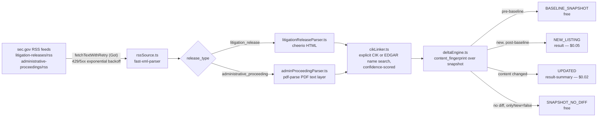

<h1 align="center">SEC Enforcement & Litigation Release Delta Feed</h1>
<p align="center"><em>A pay-per-event delta feed over SEC.gov's own litigation-release and administrative-proceeding RSS feeds — not another 10-K/8-K filings scraper.</em></p>

<p align="center">
  <a href="https://apify.com"></a>
  <a href="https://console.apify.com/actors/EDhT9Mvrdm2hzTECA"></a>
  <a href="https://www.typescriptlang.org/"></a>
  <a href="LICENSE"></a>
</p>

<p align="center"><sub>The MIT license covers this wrapper repository's documentation and integration code only — the Actor's own scraping/delta-engine implementation is proprietary and runs exclusively on Apify's platform.</sub></p>

## Run it now

<p align="center">
  <a href="https://console.apify.com/actors/EDhT9Mvrdm2hzTECA">
    
  </a>
</p>

This Actor is currently runnable via its private [Apify Console link](https://console.apify.com/actors/EDhT9Mvrdm2hzTECA); once published to the Apify Store it will also be publicly runnable at [apify.com/stefano_seggio/sec-enforcement-litigation-delta-feed](https://apify.com/stefano_seggio/sec-enforcement-litigation-delta-feed).

## What this is

If you've gone looking for an **SEC EDGAR API alternative** that covers enforcement actions rather than routine filings, the honest answer is that EDGAR's own APIs don't structure this data at all: SEC publishes litigation releases and administrative proceedings as plain RSS feeds and free-prose HTML/PDF documents, not as a queryable enforcement dataset. This Actor walks SEC.gov's own `/enforcement-litigation/litigation-releases/` and `/enforcement-litigation/administrative-proceedings/` RSS feeds directly — the same two official feeds SEC itself publishes — and turns each release into a structured, delta-classified dataset row: parsed respondent(s), statute or rule citations, a best-effort monetary-sanction breakdown, and a linked EDGAR CIK where SEC's own data resolves one with sufficient confidence.

It exists to stop the manual loop of polling `sec.gov/enforcement-litigation` for new litigation releases and PDF administrative orders, opening each one to read who's named and what statute was cited, then separately searching EDGAR by hand to see if a respondent maps to a public company's CIK. The Apify Store is already saturated with **10-K/8-K/Form-4 EDGAR-filings scrapers** covering routine disclosure; this Actor deliberately sits outside that niche and reads SEC's enforcement actions and administrative proceedings instead — the regulatory-data surface most filings scrapers don't touch.

Every run is delta-aware: a `content_fingerprint` computed over each release's full snapshot decides whether a record is a first-time listing, a content change on something already delivered, or an unchanged repeat — so you're billed only for genuinely new or changed enforcement data, not for re-reading the same release twice.

## Architecture



## Features

| Capability | What it actually does |
|---|---|
| Dual-source coverage | Independently toggle `litigation_releases` (HTML) and `administrative_proceedings` (PDF orders) via the `sources` array |
| Delta-only output by default | `onlyNew: true` ships only `NEW_LISTING`/`UPDATED` charged events; set it `false` to also see free `BASELINE_SNAPSHOT`/`SNAPSHOT_NO_DIFF` rows for QA |
| Confidence-gated EDGAR CIK linking | `enableCikLinking` + `cikMatchConfidenceThreshold` (default `0.8`) prefer an explicit "CIK No." stated in a document, and withhold a fuzzy name match below threshold rather than guess |
| Statute/rule + sanction extraction | Parses `statutes_or_rules_cited` and a sought-vs-ordered `monetary_sanctions` breakdown out of free-form release/order prose |
| Watchlist matching | `watchlistNames` sets `is_watchlist_match: true` on case-insensitive substring hits against parsed respondents |
| Per-run charge cap | `maxItemsPerRun` caps charged (`result`/`result-summary`) events per run, independent of your Apify spending limit |
| Isolated delta state per schedule | `deltaStateName` gives each schedule (e.g. full-coverage vs. watchlist-only) its own Key-Value Store so baselines don't drain each other |
| SEC-compliant request behavior | Required `userAgent` field plus configurable `requestDelayMs`/`maxRetries`/`requestTimeoutSecs` respect SEC's own fair-access policy |

## Quick start

Get an API token from the Apify Console (**Settings → Integrations**), then run `apify login`. This minimal input matches the Actor's real, required schema — `userAgent` is the only mandatory field:

```bash
apify call sec-enforcement-litigation-delta-feed <<'EOF'
{
  "sources": ["litigation_releases", "administrative_proceedings"],
  "onlyNew": true,
  "enableCikLinking": true,
  "userAgent": "Acme Compliance Monitoring contact@acme.com"
}
EOF
```

The default dataset then holds one row per delta event (`record_id`, `event_type`, `primary_respondent`, `statutes_or_rules_cited`, `monetary_sanctions`, `linked_edgar_cik`, and more — see the dataset schema for the full shape).

## Pricing (Pay-Per-Event)

| Event | Field | Price | Charged when |
|---|---|---|---|
| New Enforcement Release | `result` | **$0.05** | A litigation release or administrative proceeding not previously seen, once this schedule's baseline is established |
| Updated Release Content | `result-summary` | **$0.02** | Content on a previously-delivered release changed — real but rare, since SEC releases/orders are largely append-only once published |
| Baseline / no-diff snapshots | — | Free | Only delivered when `onlyNew: false`; never charged |

This is straight **Pay-Per-Event** pricing on Apify — there's no BYOK requirement, since the Actor calls only sec.gov and EDGAR's own free public endpoints, not a paid third-party API. Monetization is transparent by design: there's no metered free trial of paid events, so run once with `onlyNew: false` to validate field quality against real, current SEC releases at zero cost before a single `NEW_LISTING` or `UPDATED` event is ever charged.

## Why not just scrape it yourself

- **Zero infrastructure** — no server, cron host, or PDF text-extraction pipeline to stand up and maintain; Apify's platform runs the schedule
- **Managed scheduling and delta state** — `deltaEngine.ts` tracks a `content_fingerprint` per release across runs via a per-schedule Key-Value Store, so you never reprocess something unchanged
- **No proxy/rate-limit babysitting** — exponential backoff (`1000ms * 2^attempt`, jittered, capped at 15s) and a configurable request delay already honor SEC's own fair-access policy for you
- **Built-in cross-run change detection** — fingerprint-based `UPDATED` events catch SEC's own rare post-publication corrections, which a one-off cron scraper won't notice without building its own state layer

## Known limitations (disclosed, not hidden)

Discovery is bounded to each feed's real, live-confirmed ~25-item recent window — SEC's RSS feeds don't paginate further back, so this is not a historical-backfill crawler. Statute and sanction extraction is regex/pattern-based over free prose, since SEC publishes neither as a structured field. CIK linking is best-effort: individuals and unregistered or shell entities correctly and routinely resolve to no CIK. A scanned administrative order with no PDF text layer yields a metadata-only record rather than a failed run or a guess. This is not a compliance product — it structures and delta-tracks two specific public SEC pages, not FINRA, state regulators, or non-US agencies.

## Code snippets

Minimal Node.js and Python examples calling this Actor via `apify-client` are included in this repository under [`examples/`](examples).

## About Delta Registry

This Actor is part of **Delta Registry** — pay-per-event regulatory & compliance data infrastructure built and maintained by Stefano Seggio. For professional inquiries or enterprise licensing, connect on [LinkedIn](https://www.linkedin.com/in/stefanoseggio-deltaregistry). Browse the rest of the fleet on [GitHub](https://github.com/stefanoseggio).
